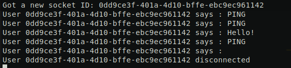

# Introduction
This repository is a class library that implements the WebSocketProtocol on the server side only. It it very performance focused and is able to handle around 8000 clients with ± 50 MB RAM and ± 1% CPU on a quad core machine in production.

# Getting Started
Follow these steps to start using this library
1. If you don't already have a dotnet project, start by creating a new one with `dotnet new console` which will create a new blank Console application.
2. Download and add a reference ot the NuGet package by running `dotnet add reference <path/to/nuget/file>. *Change this step once the classlib is live on nuget.org*
3. Now you will have to 'use' the `NarcityMedia.Net` namespace which holds the `WebSocketServer` class, among others.
4. Next, create, configure and start a `WebSocketServer`. Here's an example of a typical use of the `WebSocketServer` class.
```csharp
using System;
using System.Net;
using NarcityMedia.Net;

namespace UseSocketServer
{
    class Program
    {
        static void Main(string[] args)
        {
            // Instantiate a WebSocketServer - it won't be running at this point
            WebSocketServer Wss = new WebSocketServer();

            // Add event handlers
            Wss.OnConnect += HandleConnect;
            Wss.OnMessage += HandleMessage;
            Wss.OnDisconnect += HandleDisconnect;

            // Start the server
            try
            {
                Wss.Start(new IPEndPoint(IPAddress.Loopback, 13003));
            }
            catch (WebSocketServerException e)
            {
                Console.WriteLine("An error occured when starting the WebSocket server - " + e.Message);
            }
        }

        public static void HandleConnect(object sender, WebSocketServerEventArgs args)
        {
            // Execute logic on socket connection
            Console.WriteLine("Got a new socket ID: " + args.Cli.Id);
        }
        
        public static void HandleMessage(object sender, WebSocketServerEventArgs args)
        {
            // Execute logic on socket message
            Console.WriteLine(String.Format("User {0} says : {1}", args.Cli.Id, args.DataFrame.Plaintext));
        }
        
        public static void HandleDisconnect(object sender, WebSocketServerEventArgs args)
        {
            // Execute logic on socket disconnect
            Console.WriteLine(String.Format("User {0} disconnected", args.Cli.Id));
        }
    }
}
```
Your output should look something like this



That's it! You're good to go!


